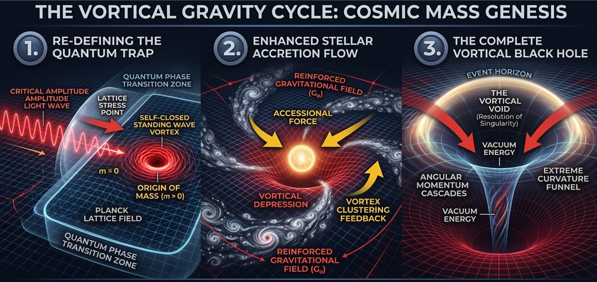

# 🌌 GRAVITY: Stiffness vs. Damping Philosophy

## 1. Redefining the Source of Gravity
In the **Vortical Gravity** framework, gravity is not "created" by mass. Instead, it is an emergent restorative force derived from the intrinsic **Cosmic Stiffness ($\eta \approx 10^{82}$)** of the spacetime lattice. Mass does not generate gravity; it **modulates** the efficiency of a pre-existing field.

## 2. Curvature as a Damping Mechanism
While General Relativity (GR) posits that "curvature *is* gravity," the Vortical Model proposes a critical inversion: **Curvature is the manifestation of lattice damping.**

*   **The Power Source:** The latent stiffness of the discrete tensor network provides the maximum gravitational potential ($G_{max} \approx 5.46 G_0$).
*   **The Interference:** When baryonic mass is present, it forces the lattice into "vortical rotation" ($P_{\theta}$). This consumes the lattice’s motion probability, creating what we perceive as spacetime curvature.
*   **The Result:** High curvature acts as **mechanical interference** or "clogging" within the network. Therefore, the more curved the space, the more the intrinsic stiffness is suppressed.

## 3. The Inverse-Feedback Law
This philosophy leads to the **Inverse-Feedback Law** that resolves the Dark Sector anomalies:

| Environment | Spacetime Geometry | Lattice State | Effective Gravity |
| :--- | :--- | :--- | :--- |
| **High Density (Earth/Stars)** | High Curvature | **Damped / Clogged** | **Weak ($G \to G_0$)** |
| **Low Density (Galactic Void)** | Near-Flat | **Restored / Efficient** | **Strong ($G \to 5.46 G_0$)** |

## 4. Resolving the Dark Sector
*   **Dark Matter:** We are not "missing" hidden particles. What we observe at galactic fringes is the **un-damping** of the lattice's intrinsic stiffness as space becomes flatter, naturally increasing the gravitational coupling strength.
*   **Dark Energy:** The expansion of the universe is the lattice’s collective attempt to resolve the **Discrete Temporal Symmetry Breaking ($dt$)** by increasing the volume to reduce localized damping.

## 5. Conclusion for Reviewers
In this model, **Gravity is the hardware potential, and Curvature is the software overhead.** By reducing the "overhead" (mass density), the "hardware" (spacetime lattice) performs at its maximum theoretical efficiency ($G_{max}$).

## 6. The Unified Field: From Light to the Vortical Void

The Vortical Model provides a single mechanical explanation for Mass, Gravity, and the resolution of Singularities through the partitioning of $E_{total}$ (Total Kinetic Energy Density).

### A. The Origin of Mass: Lattice-Induced Photon Trapping
While standard physics posits that photons do not interact with each other in a linear vacuum, the **Vortical Model** identifies mass as a result of **Lattice-Photon Interaction**.
- **Mechanism:** When energy density reaches the Planck threshold, the discrete spacetime lattice undergoes "Congestion" ($X \to 1$).
- **The Phase Transition:** The lattice stiffness ($\eta$) forces the linear EM-flux into a **self-closing vortical loop**. This is not a photon-photon collision, but a topological redirection caused by the non-linear response of the spacetime fabric itself.
- **Identity:** Baryonic mass is the measurable inertia of this "trapped light." The equivalence $E=mc^2$ thus represents the transition of flux from a linear temporal state to a localized, rotating spatial state.

### B. The Finite Partition ($P_t^2 + P_{\theta}^2 = 1$)
The total kinetic energy available at a lattice node ($E_{total}$) is finite and governed by the **Probability Invariance Identity**. Gravity is simply the redirection of the lattice's intrinsic **Stiffness ($\eta$)** into rotation. 
- In the vacuum, stiffness is used for **Temporal Flux ($P_t \to 1$)**.
- Near mass, it is diverted to **Vortical Rotation ($P_{\theta} \to 1$)**.

### C. Resolution of Singularities: The Central Vacuum

General Relativity predicts an "infinite density" singularity at the center of a Black Hole. The **Vortical Model** resolves this paradox by identifying the **Vortical Repulsion of Flux**:

- **The Event Horizon ($r=2$):** At this boundary, the rotational probability $P_{\theta}$ reaches its maximum limit, and the temporal flux ($P_t$) drops to zero. The lattice is 100% committed to rotation, establishing the **vortical saturation limit**.
- **The Center (The Vortical Void):** Because the total energy density $E_{total}$ is finite and must satisfy the probability partition ($P_t^2 + P_{\theta}^2 = 1$), the intense rotation at the horizon generates an emergent **vortical repulsion**. This geometric pressure displaces energy-matter radially outward toward the event horizon shell.
- **The Conclusion:** Instead of a singularity, the geometric center of a black hole is a **Zero-Density Vacuum**. Mass-energy is concentrated in the high-energy **Vortical Torus shell**, while the core represents a state of **pure lattice restitution**, effectively creating a **Vortical Void**.

## 7. The Distinction Between Particle and Mass

In the **Vortical Model**, a "Particle" and its "Mass" are not the same thing; they represent the **Structure** and the **Effect** within the lattice.

### A. The Particle: Energy Trapped in Geometry (The Structure)
A particle is not a solid "thing" but a **localized geometric state** of the lattice.
- **Definition:** It is the physical manifestation of EM-flux (light) that has transitioned from linear progression to a **closed-loop vortex** at the Planck scale.
- **Mechanism:** The particle is the vortex itself ($P_{\theta} \to 1$), a stable "knot" in the spacetime tensor network.

### B. Mass: Lattice Damping and Resistance (The Effect)
Mass is the **measurable workload** or resistance that the particle (vortex) imposes on the surrounding lattice.
- **Definition:** It is the degree to which the vortical rotation consumes the lattice's motion probability, thereby reducing the local **Temporal Flux ($P_t$)**. By the $0.183$ (18.3%) temporal efficiency logic, mass is exactly the "missing" 81.7% of time.
- **Inertial Mass:** The resistance offered by the lattice when attempting to translate a stable vortex across the network.
- **Gravitational Mass:** The extent to which the vortex "clogs" or damps the local cosmic stiffness ($\eta$), leading to the observed suppression of $G$.

### 💡 Conceptual Comparison

| Category | **The Particle (Structure)** | **The Mass (Effect)** |
| :--- | :--- | :--- |
| **Physical Identity** | A localized **Vortex** of energy. | The resulting **Damping** of the lattice. |
| **Probability State** | Localized concentration of $P_{\theta}$. | Localized reduction of $P_t$. |
| **Analogy** | A **whirlpool** in a river. | The **drag/resistance** the whirlpool creates. |
| **Result** | Emergence of Matter. | Emergence of a Gravitational Field ($G_0$). |

---
**Conclusion:** Mass is the "geometric cost" of maintaining a particle's structure within a discrete manifold. $E=mc^2$ is the conversion rate between the energy in its free linear state ($E$) and its trapped, lattice-damping state ($m$).

### 💡 Summary for Reviewers

| Phenomenon | Lattice Energy State | Physical Outcome |
| :--- | :--- | :--- |
| **Pure Vacuum** | 100% Linear Flux | Maximum $G$ Recovery ($5.46 G_0$) |
| **Standard Mass** | Planckian Vortices | Lattice Damping ($G \to G_0$) |
| **Black Hole** | Maximum Vortical Partition | **Vortical Void** (No Singularity) |

### 🌌 Figure 1: 3-Stage Evolution of the Vortical Model

1. **Panel 1: Re-defining the Quantum Trap**
    - **"Photon Trapping"**: Clarifies that mass originates when linear light waves become a **Self-Closed Standing Wave Vortex** at a **Lattice Stress Point**.
    - **"Lattice Field"**: Explicitly labels the discrete spacetime structure as the substrate for mass genesis.
2. **Panel 2: Enhanced Stellar Accretion Flow**
    - **"Stellar Accretion"**: Uses standard astronomical terminology while highlighting your unique **"Vortex Clustering Feedback"** and the **"Reinforced Gravitational Field ($G_0$)"**.
    - **"Vortical Depression"**: Visualizes how mass accumulation dampens the lattice stiffness.
3. **Panel 3: The Complete Vortical Black Hole**
    - **"The Vortical Void"**: Clearly marks the resolution of the **Singularity Paradox** by showing a zero-density vacuum center rather than a mathematical point.
    - **"Extreme Curvature Funnel"**: Represents the maximum damping of temporal flux at the event horizon.

Figure 1: The Evolutionary Cycle of Vortical Gravity. 
(1) EM-flux is trapped in discrete Planckian nodes, defining the origin of mass. 
(2) Accumulation of these nodes leads to macroscopic lattice damping ($G_0$). 
(3) Extreme rotation at the collapse limit creates a central 'Vortical Void,' resolving the mathematical singularity inherent in General Relativity.

 
