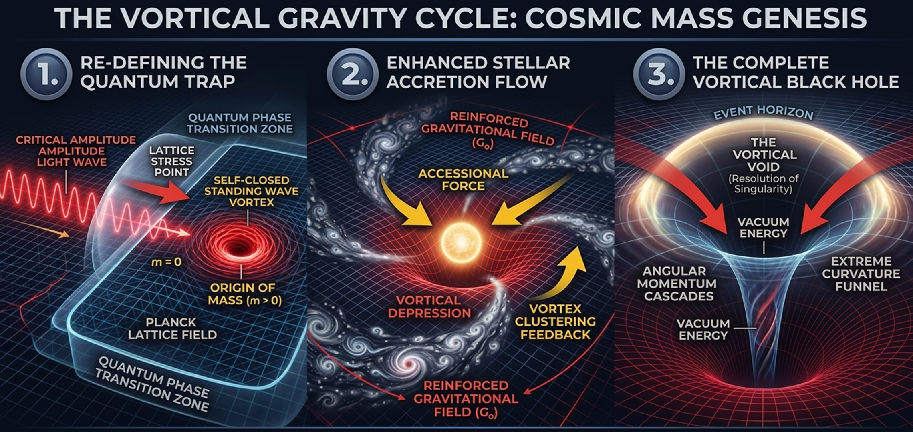

## 1. Foundational Substrate: The Nodal Bandwidth Protocol

The Vortical Lattice Dynamics (VLD) framework replaces the axiomatic continuous metric tensor $g_{\mu\nu}$ with a localized, resource-constrained discrete tensor network characterized by an Intrinsic Manifold Stiffness ($\eta \approx 10^{82}$). Macroscopic gravitation and kinematic relativity are not primary primitives; they are emergent signatures of a finite, quantized processing budget allocated across individual lattice nodes.

### 1.1 The Pythagorean Conservation Law
Driven by the irreducible temporal gap ($dt$) of the vacuum, each discrete node possesses a normalized evolutionary capacity bounded strictly by unity ($1.0$). This processing budget is partitioned dynamically between temporal state-preservation ($P_t$) and spatial state-displacement ($\mathbf{P}_x$):

$$P_t^2 + P_x^2 + P_y^2 + P_z^2 = 1$$

When the lattice spacing scales to the macroscopic limit ($l_p \to 0, dt \to 0$), this unit conservation law maps directly to physical coordinate displacements ($dx_i = c \cdot dt \cdot P_i$), where $c = l_p/dt$ is the maximum hardware state-transfer rate. This structural restriction mathematically mandates the global conservation of the Minkowski metric interval:

$$c^2 dt^2 - (dx^2 + dy^2 + dz^2) = c^2 dt'^2 - (dx'^2 + dy'^2 + dz'^2)$$

The continuous Lorentz group $SO(3,1)$ is thus derived as a top-down structural constraint born from this local resource-allocation protocol. Macroscopic Lorentz invariance is preserved because an observer's physical metrics collapse proportionally ($\gamma_L^{-1}$) as their spatial transition vectors increase.

### 1.2 Emergent Geometrization: The Strain-Ricci Mapping
When an external energy-mass distribution suppresses a node's local temporal bandwidth ($P_t^2 < 1.0$), it induces an anisotropic tensile pull on adjacent cells, generating a physical profile quantified by the **Lattice Strain Tensor ($\epsilon_{\mu\nu}$)**. Macroscopic General Relativity emerges because the Ricci curvature tensor ($R_{\mu\nu}$) is the second-order spatial gradient—the Laplacian—of this discrete strain distribution:

$$R_{\mu\nu} \approx \nabla^2 \epsilon_{\mu\nu}$$

By applying the constitutive mechanical relation $\sigma_{\mu\nu} = \eta \cdot \epsilon_{\mu\nu}$, the classical Einstein Field Equations are recovered as the smooth, low-stress ($X \ll 1$) hydrodynamic limit of the network's internal restorative drive:

$$G_{\mu\nu} = \kappa \left( \eta \cdot \epsilon_{\mu\nu} - \frac{1}{2}g_{\mu\nu} \epsilon^{\alpha}_{\alpha} \right)$$

---

## 🌌 Figure 1: The Evolutionary Cycle of Vortical Lattice Dynamics

Figure 1 illustrates the three-stage progression of energy within the discrete manifold, from the genesis of baryonic mass to the non-singular resolution of gravitational collapse.

## Stage 1: Quantized Phase Transition (Photon Trapping)

- Mechanism: Light-wave confinement within discrete Planckian nodes.
- Description: This panel depicts the origin of mass as a localized phase transition. Linear electromagnetic flux is redirected into a self-closed standing wave vortex at a critical Lattice Stress Point. This transformation satisfies the Unitary Probability Identity, where temporal flux is sacrificed to sustain the structural resonance of the particle.

## Stage 2: Macroscopic Manifold Damping (Stellar Accretion)

- Mechanism: Multi-nodal accumulation and Vortical Depression.
- Description: As quantized nodes cluster via stellar accretion, the collective rotational resonance induces a measurable damping of the intrinsic lattice stiffness ($\eta$). This creates a Vortical Depression in the spacetime fabric, manifesting as the observed terrestrial gravitational constant ($G_0$). The panel highlights the feedback loop between mass accumulation and the structural suppression of the manifold.

## Stage 3: Topological Singularity Resolution (The Vortical Engine)

- Mechanism: Formation of the Vortical Void and Resonant Torus.
- Description: At the limit of gravitational collapse, extreme rotational saturation ($P_\theta^2 \to 1.0$) triggers the Vortical Phase Transition. This panel resolves the Singularity Paradox of General Relativity by demonstrating a Zero-Density Vacuum Core ($r < 1.0$)—the Vortical Void. The extreme curvature funnel at the horizon ($r = 2.0$) represents the terminal suppression of temporal flux, while mass-energy is stabilized within the non-singular 3D Resonant Torus.

---

## 📑 Figure 1 Caption (Manuscript Standard)

Figure 1. The Lifecycle of Vortical Gravity.  
(1) Mass Genesis: EM-flux is trapped within discrete Planckian nodes, establishing the fundamental vortical resonance.  
(2) Lattice Suppression: The macroscopic accumulation of mass leads to the functional damping of global intrinsic stiffness ($G_0$).  
(3) Singularity Resolution: Relativistic rotation at the terminal collapse limit generates an outward vortical repulsion, facilitating Central Restitution. This creates a central Vortical Void, effectively replacing the divergent density of a mathematical singularity with a stabilized, high-efficiency vacuum core.

 
