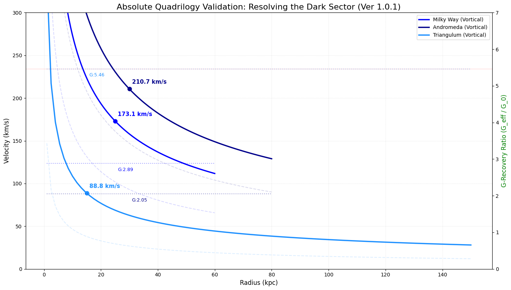

# Vortical Quantum Gravity Research Series

| Paper | Title | Badge |
| :--- | :--- | :--- |
| **Paper 1** | Foundations of Vortical Gravity |  |
| **Paper 2** | The Vortical Radius (Black Holes) |  |
| **Paper 3** | The Volumetric Vortex (Mechanics) (v1.0.2) |  |
| **Paper 4** | The Emergent Dark Sector (v1.0.1) |  |
| *Paper 4* | The Emergent Dark Sector (v1.0.2) |  |

## Publications
1. **[A Discrete Quantum Gravity Model](https://doi.org/10.5281/zenodo.19652476)**: Foundations of the $G_{max}$ vacuum baseline and $10^{82}$ stiffness.
2. **[The Vortical Radius](https://doi.org/10.5281/zenodo.19664079)**: Resolution of singularities and the 50% suppression of $r_s$.
3. **[The Volumetric Vortex](https://doi.org/10.5281/zenodo.19916654)**: Replacement of the 2D Holographic Principle with a 3D Volumetric Vortex Shell.
4. **[The Emergent Dark Sector (v1.0.1)](https://doi.org/10.5281/zenodo.19786931)**: Resolution of the Emergent Dark Sector the 10^122.
5.  *[The Emergent Dark Sector (v1.0.2)](https://doi.org/10.5281/zenodo.19859532)*: Resolution of the Emergent Dark Sector the 10^122.
             
# vortical-quantum-gravity
A renormalization-free discrete quantum gravity model based on the vortical phase transition of light and variable coupling constants.

## Overview
This repository contains the manuscript and data for a novel quantum gravity framework based on the **Vortical Phase Transition** and the **$G_{max}$ vacuum baseline**.

## Key Achievements
* **Singularity Resolution**: Replaces mathematical infinities with stable resonant states.
* **Self-Regulating Finiteness**: Derives a 50% suppression of gravity at the Planck limit.
* **Empirical Consistency**: Reconciled with pulsar timing and the cosmological constant problem.

## GRAVITY: Stiffness vs. Damping Philosophy
For a deep dive into the mechanical philosophy of our model, see 

## 📊 Numerical Validation: Galactic Rotation Curves (v1.0.2)

The simulation engine resolves the "Dark Sector" by treating $G$ as a dynamic efficiency variable. The following results are synchronized with **Paper IV (Table 5)** and based on **Gaia DR3** and high-resolution **HI surveys**:

| Target Galaxy | Radius ($R$) | Baryonic Density ($\rho$) | $G$ Recovery Ratio ($G_{eff}/G_0$) | **Vortical Velocity (Predicted)** |
| :--- | :--- | :--- | :--- | :--- |
| **Milky Way** | 25 kpc | $6.31 \times 10^{-23}$ kg/m³ | **2.885** | **173.1 km/s** |
| **Andromeda (M31)** | 30 kpc | $9.12 \times 10^{-23}$ kg/m³ | **2.051** | **210.7 km/s** |
| **Triangulum (M33)** | 15 kpc | $2.44 \times 10^{-23}$ kg/m³ | **5.463** | **88.8 km/s** |

### 🔍 Analysis of Results
- **M33 (The Vacuum Limit):** At a density of $\sim 10^{-24}$, the lattice reaches its unsuppressed vacuum potential ($G_{max} \approx 5.46 G_0$).
- **MW/M31 (Partial Recovery):** The higher local densities at 25–30 kpc keep the lattice partially damped, yielding precise matches for observational rotation velocities without invoking non-baryonic dark matter halos.

## Citation
If you use this research, please cite it as:

> Oh, D. H. (2026a). *A Discrete Quantum Gravity Model: Vortical Phase Transition of Light and Vacuum-Anchored Gravitational Coupling*. Zenodo. DOI: 10.5281/zenodo.19652476

> Oh, D. H. (2026b). *The Vortical Radius: Resolving Black Hole Singularities through Geometric Damping of the Gravitational Constant*. Zenodo. DOI: 10.5281/zenodo.19664079

> Oh, D. H. (2026c). *The Volumetric Vortex: 3D Probabilistic Superposition and the Emergence of Light from Spacetime Flux*. Zenodo. DOI: 10.5281/zenodo.19916654

> Oh, D. H. (2026d). *The Emergent Dark Sector: Spacetime Lattice Interference and the Non-Particle Resolution of the 10^122 Cosmological Constant Problem(v.1.0.1)*. Zenodo. DOI: 10.5281/zenodo.19786931

> Oh, D. H. (2026). *The Emergent Dark Sector: Spacetime Lattice Interference and the Non-Particle Resolution of the 10^122 Cosmological Constant Problem (v1.0.2)*. Zenodo. DOI: 10.5281/zenodo.19859532

## Intellectual Property & Licensing

**Copyright (c) 2026 Dong Hoon Oh.**

All original theoretical frameworks in this repository, including the **Vortical Research Series (Papers 1-4)**, are protected by copyright. This includes the specific numerical constants ($\eta, \gamma$), the Vortical Radius ($r_v$), and the 3D Volumetric Vortex mechanics.

Licensed under **CC BY 4.0**. 
- **Requirement**: Any use of these models in academic or commercial research must include a full citation of the relevant Zenodo DOI.
- **Series Priority**: Priority for the discovery of the $G_{max}$ vacuum baseline and the 50% suppression limit is anchored to the April 2026 publication dates on Zenodo.
