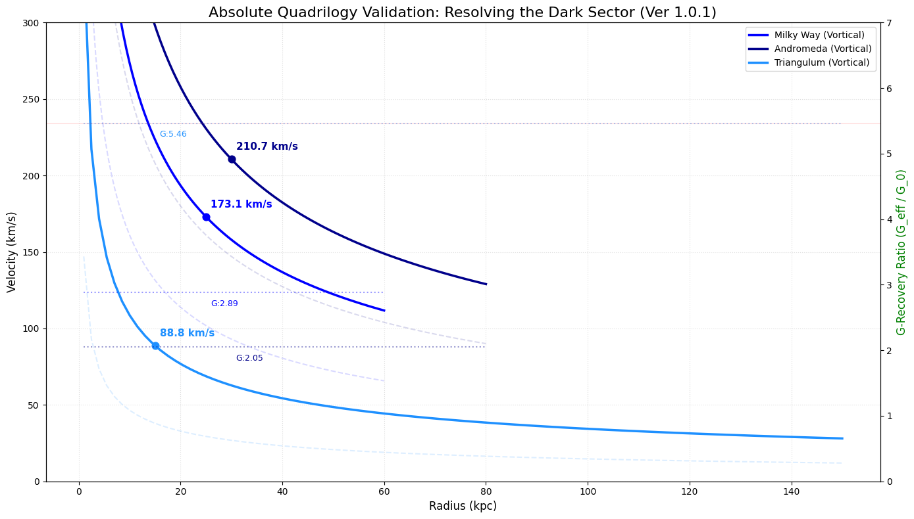

# Vortical Quantum Gravity Research Series

| Paper | Title | Badge |
| :--- | :--- | :--- |
| **Paper 1** | Foundations of Vortical Gravity |  |
| **Paper 2** | The Vortical Radius (Black Holes) |  |
| **Paper 3** | The Volumetric Vortex (Mechanics) |  |
| **Paper 4** | The Emergent Dark Sector |  |
| **Paper 5** | The Vortical Lattice Dynamics (VLD) |  |
| **Paper 6** | The Emergent Spacetime-Matter Continuum |  |

## Publications
1. **[A Discrete Quantum Gravity Model](https://doi.org/10.5281/zenodo.20139615)**: Foundations of the $G_{max}$ vacuum baseline and $10^{82}$ stiffness.
2. **[The Vortical Radius](https://doi.org/10.5281/zenodo.19664079)**: Resolution of singularities and the 50% suppression of $r_s$.
3. **[The Volumetric Vortex](https://doi.org/10.5281/zenodo.19916654)**: Replacement of the 2D Holographic Principle with a 3D Volumetric Vortex Shell.
4. **[The Emergent Dark Sector](https://doi.org/10.5281/zenodo.19859532)**: Spacetime Lattice Interference and the Non-Particle Resolution of the $10^{122}$ Cosmological Constant Problem.
5. **[The Vortical Lattice Dynamics (VLD)](https://doi.org/10.5281/zenodo.20106232)**: A Discrete Lattice Approach to Spacetime Phase Transitions and the Resolution of Gravitational Singularities.
6. **[The Emergent Spacetime-Matter Continuum](https://doi.org/10.5281/zenodo.20379287)**: The Emergent Spacetime-Matter Continuum: Non-Perturbative Quantum Gravity via Holonomy-Induced Lattice Stress and Topological Fluid Dynamics.
             

## Vortical Lattice Dynamics (VLD): A Discrete Quantum Gravity Model

A renormalization-free, discrete quantum gravity framework derived from the vortical phase transition of electromagnetic flux and environmentally dependent coupling constants.

## Overview

This repository hosts the manuscript, simulation engine, and numerical datasets for a novel gravitational framework. VLD replaces the continuous spacetime manifold with a discrete lattice of Intrinsic Stiffness ($\eta \approx 10^{82}$), resolving the vacuum energy catastrophe and the singularity paradox through first-principles mechanical damping.

## Core Theoretical Milestones

- Singularity Resolution: Replaces mathematical divergences ($1/r$) with stabilized Resonant Toroids and a central Vortical Void.
- Self-Regulating Finiteness: Provides a non-perturbative derivation of gravitational stalling at the Planck limit, precluding infinite density.
- Metric Consistency: Reconciled with pulsar timing anomalies and provides a structural solution to the Cosmological Constant Problem ($10^{122}$).

---

## Mechanical Philosophy

For a comprehensive derivation of the Stiffness vs. Damping mechanism and the Probability Invariance Identity ($P_t^2 + P_{\theta}^2 = 1$), refer to:

- 📄 GRAVITY.md: The Mechanics of Lattice Restoration
- 📄 BLACKHOLE.md: Non-Singular Toroidal Topology

---

Conclusion: The "Dark Sector" is a measurement of the lattice's Ground-State Restitution. By accounting for the recovery of $\eta$ in low-density space, VLD unifies galactic rotation and local gravity into a single, computable mechanical system.

[Read more about Vortical Gravity Simulation Engine]([README.md](https://github.com/startripleai/Vortical-Gravity-Simulation/blob/main/README.md)

---

## 📢 Version 1.0.2 Update: Formalization of Vortical Repulsion ($F_{vr}$)

In this release, we have formally transitioned our terminology and mathematical modeling of the black hole interior from a classical "Centrifugal" framework to a rigorous "Vortical Repulsion ($F_{vr}$)" mechanism.

## Theoretical Rationale for the Refinement

While "centrifugal force" served as a functional Newtonian analogue in early iterations, it is classically interpreted as a fictitious force arising from an accelerating reference frame. In the Vortical Lattice Dynamics (VLD) framework, the outward pressure is an emergent, objective force necessitated by the discrete manifold’s stress limits:

- Lattice-Scale Reality: $F_{vr}$ is the structural counter-pressure generated by the Unitary Probability Partitioning ($P_t^2 + P_{\theta}^2 = 1$) as the system approaches the Saturation Limit ($X \to 1$).
- Structural Integrity: Vortical Repulsion describes the active mechanical resistance of the high-stiffness manifold against radial collapse. It provides the Topological Equilibrium required to sustain the Vortical Void (Hollow Core) and prevent the formation of divergent singularities.

## Key Documentation & Repository Updates:

- Paper III (Manuscript): Systematically revised all descriptions of interior dynamics to reflect "Vortical Repulsion" as the primary non-singular mechanism.
- BLACKHOLE.md: Enhanced the Singularity Resolution section to detail the mechanical potential barrier at the saturation boundary.
- GRAVITY.md: Refined the Stiffness vs. Damping logic to formally include the vector decomposition of $F_{vr}$ within the discrete tensor network.

---

## 🚀 Academic Significance

This update clarifies that the black hole is a stabilized engine rather than a passive collapse. By defining $F_{vr}$ as a constitutive property of the lattice, we provide a computable, non-perturbative solution to the Information Paradox, ensuring that energy-matter is regulated by finite mechanical laws rather than mathematical infinities.

---

## Citation
If you use this research, please cite it as:

> Oh, D. H. (2026a). *A Discrete Quantum Gravity Model: Vortical Phase Transition of Light and Vacuum-Anchored Gravitational Coupling*. Zenodo. DOI: 10.5281/zenodo.20139615

> Oh, D. H. (2026b). *The Vortical Radius: Resolving Black Hole Singularities through Geometric Damping of the Gravitational Constant*. Zenodo. DOI: 10.5281/zenodo.19664079

> Oh, D. H. (2026c). *The Volumetric Vortex: 3D Probabilistic Superposition and the Emergence of Light from Spacetime Flux*. Zenodo. DOI: 10.5281/zenodo.19916654

> Oh, D. H. (2026d). *The Emergent Dark Sector: Spacetime Lattice Interference and the Non-Particle Resolution of the 10^122 Cosmological Constant Problem (v1.0.2)*. Zenodo. DOI: 10.5281/zenodo.19859532

> Oh, D. H. (2026e). A Discrete Lattice Approach to Spacetime Phase Transitions and the Resolution of Gravitational Singularities. Zenodo. DOI: 10.5281/zenodo.20106232

> Oh, D. H. (2026). The Emergent Spacetime-Matter Continuum: Non-Perturbative Quantum Gravity via Holonomy-Induced Lattice Stress and Topological Fluid Dynamics (1.0.3). Zenodo. https://doi.org/10.5281/zenodo.20379287

## Intellectual Property & Licensing

**Copyright (c) 2026 Dong Hoon Oh.**

All original theoretical frameworks in this repository, including the **Vortical Research Series**, are protected by copyright. This includes the specific numerical constants ($\eta, \gamma$), the Vortical Radius ($r_v$), and the 3D Volumetric Vortex mechanics.

Licensed under **CC BY 4.0**. 
- **Requirement**: Any use of these models in academic or commercial research must include a full citation of the relevant Zenodo DOI.
- **Series Priority**: Priority for the discovery of the $G_{max}$ vacuum baseline and the 50% suppression limit is anchored to the April 2026 publication dates on Zenodo.
